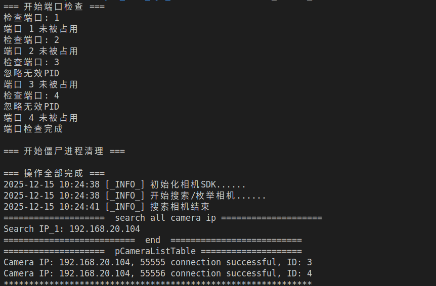
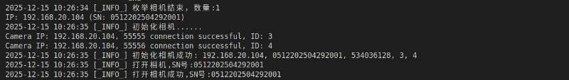
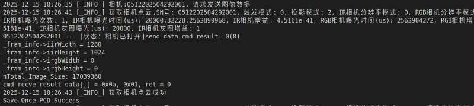

接口
=========

.. toctree:: 
	:maxdepth: 5

初始化相机SDK
---------------
.. c:function:: CameraSdkStatus CameraSdkInit()

   初始化SDK。
   
   **描述**
   
   该函数在整个进程运行期间只需要调用一次。初始化相机SDK的全局环境，
   为后续的相机操作做准备。
   
   **返回值**
   
   :成功: 返回 ``CAMERA_STATUS_SUCCESS`` (0)
   :失败: 返回非0值的错误码，请参考 CameraStatus.h 中错误码的定义
   
   **注意事项**
   
   * 必须在调用其他SDK函数之前调用此函数
   * 整个进程生命周期内只需调用一次
   * 建议在程序启动时初始化
   
   **示例**
   
   .. code-block:: c
   
	  CameraSdkStatus status = CameraSdkInit();
	  if (status != CAMERA_STATUS_SUCCESS) {
		  printf("SDK初始化失败，错误码: %d\n", status);
		  return -1;
	  }
	  printf("SDK初始化成功\n");

	初始化sdk输出结果

初始化sdk输出结果枚举相机设备，并建立设备列表
--------------------------------------------
.. c:function:: CameraSdkStatus CameraEnumerateDevice(tSdkCameraDevInfo* pCameraList, int* piNums, uint32_t wTimes)

   枚举Camera设备，并建立设备列表。
   
   **描述**
   
   扫描系统中所有可用的相机设备，将设备信息填充到指定的数组中，
   并返回实际发现的设备数量。
   
   **参数**
   
   .. list-table:: 参数说明
	  :widths: 25 25 50
	  :header-rows: 1
	  
	  * - 参数名
		- 方向
		- 描述
	  * - ``pCameraList``
		- [out]
		- 设备列表数组指针，用于接收设备信息
	  * - ``piNums``
		- [in, out]
		- 设备数量指针
		  * 输入：pCameraList数组的元素个数
		  * 输出：实际找到的设备个数
	  * - ``wTimes``
		- [in]
		- 枚举相机超时时间，单位：秒
   
   **返回值**
   
   :成功: 返回 ``CAMERA_STATUS_SUCCESS`` (0)
   :失败: 返回非0值的错误码，请参考 CameraStatus.h 中错误码的定义
   
   **使用示例**
   
   .. code-block:: c
   
	  #include <stdio.h>
	  #include "CameraSdk.h"
	  
	  int main() {
		  CameraSdkStatus status;
		  tSdkCameraDevInfo cameraList[10];
		  int cameraCount = 10;  // 数组容量
		  uint32_t timeout = 5;  // 5秒超时
		  
		  // 枚举设备
		  status = CameraEnumerateDevice(cameraList, &cameraCount, timeout);
		  
		  if (status == CAMERA_STATUS_SUCCESS) {
			  printf("找到 %d 个相机设备:\n", cameraCount);
			  for (int i = 0; i < cameraCount; i++) {
				  printf("  设备 %d: SN=%s, IP=%s, 型号=%s\n",
						 i + 1,
						 cameraList[i].cameraSn,
						 cameraList[i].cameraIP,
						 cameraList[i].cameraType);
			  }
		  } else {
			  printf("枚举设备失败，错误码: %d\n", status);
		  }
		  
		  return 0;
	  }
   
   **注意事项**
   
   1. 调用此函数前必须先调用 ``CameraSdkInit()`` 初始化SDK
   2. ``pCameraList`` 数组需要预分配足够空间
   3. ``piNums`` 参数既是输入也是输出，调用时需要设置为数组容量
   4. 如果实际设备数超过数组容量，只会填充数组大小的设备信息

相机初始化
------------
.. c:function:: CameraSdkStatus CameraInit(int iDeviceIndex, CameraHandle* pCameraHandle)

   相机初始化。
   
   **描述**
   
   初始化指定索引的相机设备。初始化成功后，才能调用其他相机相关的操作接口。
   该函数会建立与相机的通信连接，并分配相应的资源。
   
   **参数**
   
   .. list-table:: 参数说明
	  :widths: 25 25 50
	  :header-rows: 1
	  
	  * - 参数名
		- 方向
		- 描述
	  * - ``iDeviceIndex``
		- [in]
		- 相机的索引号，取值范围为 0 到 ``CameraEnumerateDeviceEx`` 返回的相机个数减1
	  * - ``pCameraHandle``
		- [out]
		- 相机的句柄指针，初始化成功后，该指针返回该相机的有效句柄
   
   **返回值**
   
   :成功: 返回 ``CAMERA_STATUS_SUCCESS`` (0)
   :失败: 返回非0值的错误码，请参考 CameraStatus.h 中错误码的定义
   
   
   **使用示例**
   
   .. code-block:: c
	  :linenos:
	  
	  #include <stdio.h>
	  #include "CameraSdk.h"
	  
	  int main() {
		  CameraSdkStatus status;
		  tSdkCameraDevInfo cameraList[10];
		  int cameraCount = 10;
		  
		  // 1. 枚举设备
		  status = CameraEnumerateDevice(cameraList, &cameraCount, 5);
		  if (status != CAMERA_STATUS_SUCCESS || cameraCount == 0) {
			  printf("未找到相机设备\n");
			  return -1;
		  }
		  
		  printf("发现 %d 个相机设备\n", cameraCount);
		  
		  // 2. 初始化第一个相机
		  CameraHandle hCamera = NULL;
		  status = CameraInit(0, &hCamera);
		  
		  if (status == CAMERA_STATUS_SUCCESS) {
			  printf("相机初始化成功，句柄: %p\n", (void*)hCamera);
			  
			  // 3. 使用相机...
			  
			  // 4. 最后要释放相机
		  } else {
			  printf("相机初始化失败，错误码: %d\n", status);
		  }
		  
		  return 0;
	  }
   
   **注意事项**
   
   1. **调用顺序**：必须先调用 ``CameraSdkInit()`` 和 ``CameraEnumerateDevice()`` 后，才能调用此函数
   2. **索引范围**：``iDeviceIndex`` 必须在有效的设备索引范围内（0 ~ 设备数-1）
   3. **句柄管理**：成功初始化后获得的 ``CameraHandle`` 需要保存，后续所有相机操作都需要此句柄
   4. **资源释放**：使用完相机后，必须调用 ``CameraStop()`` 释放资源
   5. **多相机支持**：可以多次调用此函数初始化多个相机，每个相机有独立的句柄
   
   **相关函数**
   
   * :c:func:`CameraSdkInit` - SDK全局初始化
   * :c:func:`CameraEnumerateDevice` - 枚举相机设备
   * :c:func:`CameraStop` - 反初始化相机

	
	枚举相机并进行相机初始化
运行相机
-----------
.. c:function:: CameraSdkStatus CameraPlay(char pCameraSn[32])

   让相机进入工作模式，开始接收来自相机发送的图像数据。
   
   **描述**
   
   启动指定SN序列号的相机，使其进入图像采集工作模式。
   调用此函数后，相机开始发送图像数据，可以通过回调函数或主动获取的方式接收图像。
   
   **参数**
   
   .. list-table:: 参数说明
	  :widths: 25 25 50
	  :header-rows: 1
	  
	  * - 参数名
		- 方向
		- 描述
	  * - ``pCameraSn``
		- [in]
		- 相机的SN（序列号），长度不超过32个字符（包括终止符）
   
   **返回值**
   
   :成功: 返回 ``CAMERA_STATUS_SUCCESS`` (0)
   :失败: 返回非0值的错误码，请参考 CameraStatus.h 中错误码的定义
   
   
   **使用示例**
   
.. code-block:: cpp
   :linenos:
   
   #include "CameraApi.h"
   #include <stdio.h>
   #include <string.h>
   
   int main() {
	   CameraSdkStatus ret;
	   tSdkCameraDevInfo dev_info[10];
	   int n_dev_num = 10;
	   
	   // 1. 初始化SDK
	   ret = CameraSdkInit();
	   if (ret != CAMERA_STATUS_SUCCESS) {
		   perror("Camera SDK Init Error!");
		   return -1;
	   }
	   
	   // 2. 枚举设备
	   ret = CameraEnumerateDevice(dev_info, &n_dev_num, 2);
	   if (ret != CAMERA_STATUS_SUCCESS) {
		   std::cerr << "Camera EnumerateDevice Error!" << std::endl;
		   return -1;
	   }
	   
	   if (n_dev_num <= 0) {
		   printf("未找到相机设备\n");
		   return -1;
	   }
	   
	   // 3. 初始化相机（获取句柄）
	   CameraHandle hCamera;
	   ret = CameraInit(0, &hCamera);  // 初始化第一个设备
	   if (ret != CAMERA_STATUS_SUCCESS) {
		   fprintf(stderr, "相机初始化失败\n");
		   return -1;
	   }
	   
	   // 4. 获取相机SN（从设备信息中）
	   char cameraSn[32];
	   strncpy(cameraSn, dev_info[0].cameraSn, sizeof(cameraSn) - 1);
	   cameraSn[sizeof(cameraSn) - 1] = '\0';
	   
	   // 5. 启动相机采集
	   ret = CameraPlay(cameraSn);
	   if (ret == CAMERA_STATUS_SUCCESS) {
		   fprintf(stderr, "相机 %s --- [状态：相机已打开]\n", cameraSn);
	   } else {
		   fprintf(stderr, "相机 %s --- [状态：打开相机失败]，错误码: %d\n", cameraSn, ret);
		   CameraUnInit(hCamera);
		   return -1;
	   }
	   
	   // 6. 执行其他操作（如图像采集、处理等）
	   // ...
	   
	   // 7. 停止采集
	   CameraStop(cameraSn); 

	
	相机采集结果

停止相机
----------------
.. c:function:: CameraSdkStatus CameraStop(char pCameraSn[32])

   让相机进入停止状态。
   
   **描述**
   
   停止指定SN序列号相机的所有采集活动，并使相机进入停止状态。
   该函数通常在相机反初始化前调用，停止后不能再对相机参数进行配置。
   
   **参数**
   
   .. list-table:: 参数说明
	  :widths: 25 25 50
	  :header-rows: 1
	  
	  * - 参数名
		- 方向
		- 描述
	  * - ``pCameraSn``
		- [in]
		- 相机的SN（序列号），长度不超过32个字符（包括终止符）
   
   **返回值**
   
   :成功: 返回 ``CAMERA_STATUS_SUCCESS`` (0)
   :失败: 返回非0值的错误码，请参考 CameraStatus.h 中错误码的定义
   
获取采集数据
-------------
.. c:function:: CameraSdkStatus CameraGetImageBuffer(char pCameraSn[32], tSdkFrameHead* pFrameInfo, char* pbyBuffer, uint32_t wTimes)

   获得一帧2D或3D图像数据。
   
   **描述**
   
   从指定SN序列号的相机获取一帧图像数据，包括2D原始图像或3D点云数据。
   该函数会阻塞调用线程，直到获取到图像或超时。
   
   **参数**
   
   .. list-table:: 参数说明
	  :widths: 25 20 55
	  :header-rows: 1
	  
	  * - 参数名
		- 方向
		- 描述
	  * - ``pCameraSn``
		- [in]
		- 相机的SN（序列号），长度不超过32个字符
	  * - ``pFrameInfo``
		- [out]
		- 图像的帧头信息指针，用于接收图像元数据
	  * - ``pbyBuffer``
		- [out]
		- 返回图像数据的缓冲区指针，调用前需要预分配足够空间
	  * - ``wTimes``
		- [in]
		- 抓取图像的超时时间，单位毫秒。超时未获得图像则返回超时错误
   
   **返回值**
   
   :成功: 返回 ``CAMERA_STATUS_SUCCESS`` (0)
   :失败: 返回非0值的错误码，请参考 CameraStatus.h 中错误码的定义

获取点云数据
--------------
.. c:function:: CameraSdkStatus CameraGetPointCloudData(char pCameraSn[32], tSdkSendPCDParam pPCDParam)

   从线程中获取一帧点云数据。
   
   **描述**
   
   触发指定SN序列号的相机采集一帧点云数据（3D数据）。
   该函数会发送采集指令到相机，然后相机开始采集过程，点云数据通过回调函数或
   ``CameraGetImageBuffer`` 返回。
   
   **参数**
   
   .. list-table:: 参数说明
	  :widths: 25 20 55
	  :header-rows: 1
	  
	  * - 参数名
		- 方向
		- 描述
	  * - ``pCameraSn``
		- [in]
		- 相机的SN（序列号），长度不超过32个字符
	  * - ``pPCDParam``
		- [in]
		- 点云数据配置参数结构体，设置采集模式和参数
   
   **返回值**
   
   :成功: 返回 ``CAMERA_STATUS_SUCCESS`` (0)
   :失败: 返回非0值的错误码，请参考 CameraStatus.h 中错误码的定义

多线程采集数据
---------------

概述
----

``uiDisplayThread`` 是一个独立的图像采集和显示线程函数，负责从相机获取2D/3D图像数据并进行处理显示。

函数原型
--------

.. code-block:: cpp
   
   void* uiDisplayThread(void* lpParam);

参数说明
-------

.. list-table:: 参数说明
   :widths: 25 75
   :header-rows: 1
   
   * - 参数
	 - 描述
   * - ``lpParam``
	 - 线程参数指针，指向 :c:type:`tSdkCameraDevInfo` 结构体，包含相机设备信息

返回值
-----

* 成功：返回 ``NULL``
* 失败：函数不会显式返回失败，但会通过全局变量 ``running`` 控制退出

功能说明
-------

该函数实现以下功能：

1. **初始化资源**：根据相机分辨率分配图像缓冲区
2. **循环采集**：持续从相机获取图像数据
3. **数据分类**：根据帧类型处理2D图像或3D点云数据
4. **显示/保存**：显示2D图像或保存3D点云数据到文件

工作流程
-------

.. code-block:: text
   
   线程启动
	 ↓
   分配缓冲区 (Xw, Yw, Zw, pGrayBuffer等)
	 ↓
   while(running) 循环
	 ↓
   CameraGetImageBuffer() 获取图像
	 ↓
   判断 FrameInfo.iType
	 ├─ DTU_FRAME_RAW (2D图像) → 显示左右相机图像
	 └─ DTU_FRAME_MAP (3D点云) → 保存点云数据到文件
	 ↓
   等待下一帧
	 ↓
   running = false → 释放资源 → 线程退出

完整代码
--------

.. code-block:: cpp
   :linenos:
   :emphasize-lines: 30-35, 44-48, 60-65
   
   void* uiDisplayThread(void* lpParam) {
	   tSdkCameraDevInfo* devInfo = (tSdkCameraDevInfo*)lpParam;
   
	   int nImage_Width_IR = devInfo->irCameraResWidth;
   	int nImage_Height_IR = devInfo->irCameraResHeight;
   	int nImage_Width_RGB = devInfo->rgbCameraResWidth;
   	int nImage_Height_RGB = devInfo->rgbCameraResHeight;
	   int nImage_Size_IR = nImage_Width_IR * nImage_Height_IR;
	   int nImage_Size_RGB = nImage_Width_RGB * nImage_Height_RGB;
	   
   	float *Xw = new float[nImage_Size_IR];
   	float *Yw = new float[nImage_Size_IR];
   	float *Zw = new float[nImage_Size_IR];
   	char *pGrayBuffer = new char[nImage_Size_IR];
   
	   tSdkFrameHead FrameInfo;
	   char* pbyBuffer = new char[nImage_Size_IR * 16];
   
	   uint8_t* T_L = new uint8_t[nImage_Size_IR];
	   uint8_t* T_R = new uint8_t[nImage_Height_IR];
   
	   while (running) {
		   // 获取图像数据，超时时间1000ms
		   int ii = CameraGetImageBuffer(devInfo->cameraSn, &FrameInfo, pbyBuffer, 1000);
   
		   if (FrameInfo.iType == DTU_FRAME_RAW) {
   			continue;  // 跳过2D图像处理（示例中跳过）
			   // 接收并显示2D图像
			   memset(T_R, 0, nImage_Size_IR);
			   memcpy(T_R, pbyBuffer, nImage_Size_IR);
			   cv::Mat mat_RightCamera(nImage_Height_IR, nImage_Width_IR, CV_8UC1, T_R);
   
			   memset(T_L, 0, nImage_Size_IR);
			   memcpy(T_L, pbyBuffer + nImage_Size_IR, nImage_Size_IR);
			   cv::Mat mat_LeftCamera(nImage_Height_IR, nImage_Width_IR, CV_8UC1, T_L);
   
			   cv::namedWindow("Right Camera_1", 0);
			   cv::resizeWindow("Right Camera_1", nImage_Width_IR / 2, nImage_Height_IR / 2);
			   cv::imshow("Right Camera_1", mat_RightCamera);
   
			   cv::namedWindow("Left Camera_1", 0);
			   cv::resizeWindow("Left Camera_1", nImage_Width_IR / 2, nImage_Height_IR / 2);
			   cv::imshow("Left Camera_1", mat_LeftCamera);
   
			   if (FrameInfo.iRGBWidth != 0) {
				   uint8_t * mjpg = (uint8_t*)(pbyBuffer + 13 * nImage_Size_IR);
				   std::vector<uchar> copiedVec(mjpg, mjpg + FrameInfo.iDataSize -  13 * nImage_Size_IR);
				   cv::Mat jpg_frame = cv::imdecode(copiedVec, cv::IMREAD_COLOR);
				   cv::resize(jpg_frame, jpg_frame, cv::Size(), 0.5, 0.5); // 缩小为原来的一半
				   cv::imshow("RGB_MJPG", jpg_frame);
			   }
			   cv::waitKey(1);
		   } else if (FrameInfo.iType == DTU_FRAME_MAP) {
   
			   // 接收并显示3D图像
			   if (FrameInfo.iPointCloudDataType == CLOUD) {
				   char file_name[256];
				   FILE* pFile;
				   // 点云X信息
				   memcpy(Xw, pbyBuffer, nImage_Size_IR * sizeof(float));
				   // 点云Y信息
				   memcpy(Yw, pbyBuffer + nImage_Size_IR * 4 * 1, nImage_Size_IR * sizeof(float));
				   // 点云Z信息
				   memcpy(Zw, pbyBuffer + nImage_Size_IR * 4 * 2, nImage_Size_IR * sizeof(float));
   
				   // 矫正之后的左相机图(2D)
				   memcpy(pGrayBuffer, pbyBuffer + nImage_Size_IR * 4 * 3, nImage_Size_IR);
   
   				FILE* FilePosition_Xw = fopen("./Xw.txt", "w");
				   for (int i = 0; i < nImage_Size_IR; i++)
				   {
						   fprintf(FilePosition_Xw, "%f\n", Xw[i]);
				   }
   				fclose(FilePosition_Xw);
   
				   FILE* FilePosition_Yw = fopen("./Yw.txt", "w");
   				for (int i = 0; i < nImage_Size_IR; i++)
   				{
   					fprintf(FilePosition_Yw, "%f\n", Yw[i]);
   				}
   				fclose(FilePosition_Yw);
   				FILE* FilePosition_Zw = fopen("./Zw.txt", "w");
				   int count = 0;
   				for (int i = 0; i < nImage_Size_IR; i++)
   				{
   					fprintf(FilePosition_Zw, "%f\n", Zw[i]);
					   if(Zw[i] != 0 )
						   count++;
   				}
   				fclose(FilePosition_Zw);
   
				   cv::Mat image(nImage_Height_IR, nImage_Width_IR, CV_8UC(1), pGrayBuffer);
   				cv::imwrite("./pGrayBuffer.bmp", image);
   
				   m_bNewPCDbuffer = 1;
				   fprintf(stderr, "Save Once Cloud Ok!, Useful Cloud Count: %d\n", count);
			   }
		   }
	   }
	   return NULL; 
   }

参数设置与获取
-------------
概述
----

相机内置的曝光参数、拍摄模式等参数支持两种配置方式：

1. **直接修改结构体**：定义参数结构体，直接修改成员值
2. **使用API函数**：调用专用的设置/获取函数

两种方式可以单独使用，也可以组合使用。

设置曝光参数、获取曝光参数
--------------------------
CameraSetExposureTime
---------------------

.. c:function:: CameraSdkStatus CameraSetExposureTime(char pCameraSn[32], int nCameraID, int iExposureTime)

   设置相机曝光时间。
   
   **描述**
   
   设置指定相机镜头的曝光时间，单位为微秒(μs)。
   该函数会直接修改对应的 :c:type:`tSdkSendPCDParam` 结构体中的曝光时间数值。
   
   **参数**
   
   .. list-table:: 参数说明
	  :widths: 25 20 55
	  :header-rows: 1
	  
	  * - 参数名
		- 方向
		- 描述
	  * - ``pCameraSn``
		- [in]
		- 相机的SN（序列号）
	  * - ``nCameraID``
		- [in]
		- 相机镜头ID：
		  
		  * 0：左黑白镜头（对应 iIRExposureTimes1）
		  * 1：右黑白镜头（对应 iIRExposureTimes2）
		  * 2：彩色镜头（对应 iRGBExposureTimes）
	  * - ``iExposureTime``
		- [in]
		- 曝光时间，单位微秒(μs)
   
   **返回值**
   
   :成功: 返回 ``CAMERA_STATUS_SUCCESS`` (0)
   :失败: 返回非0值的错误码，请参考 CameraStatus.h 中错误码的定义
   
   **注意事项**
   
   1. **参数对应关系**：
	  
	  .. list-table:: 镜头ID与参数对应关系
		 :widths: 20 30 50
		 
		 * - 镜头ID
		   - 结构体参数
		   - 说明
		 * - 0 (左黑白)
		   - ``iIRExposureTimes1``
		   - 第一次曝光时间
		 * - 1 (右黑白)
		   - ``iIRExposureTimes2``
		   - 第二次曝光时间
		 * - 2 (彩色)
		   - ``iRGBExposureTimes``
		   - RGB相机曝光时间
   
   2. **生效时机**：设置后需要重新采集图像才能生效
   3. **单位**：微秒(μs)，1毫秒 = 1000微秒

触发模式设置与获取函数
--------------------

CameraSetTriggerMode
--------------------

.. c:function:: CameraSdkStatus CameraSetTriggerMode(char pCameraSn[32], int iModeSel)

   设置相机的触发模式。
   
   **描述**
   
   设置指定相机的图像采集触发模式，控制图像采集的启动方式。
   
   **参数**
   
   .. list-table:: 参数说明
	  :widths: 25 20 55
	  :header-rows: 1
	  
	  * - 参数名
		- 方向
		- 描述
	  * - ``pCameraSn``
		- [in]
		- 相机的SN（序列号）
	  * - ``iModeSel``
		- [in]
		- 模式选择索引号：
		  
		  * 0：连续采集模式
		  * 1：触发采集模式
   
   **返回值**
   
   :成功: 返回 ``CAMERA_STATUS_SUCCESS`` (0)
   :失败: 返回非0值的错误码，请参考 CameraStatus.h 中错误码的定义

设置相机保护罩开启或关闭
----------------------

CameraSetDoorState
------------------

.. c:function:: CameraSdkStatus CameraSetDoorState(char pCameraSn[32], int iDoorState, int &call_size, char *recv_bytes)

   设置相机前盖板状态。
   
   **描述**
   
   控制指定相机的前盖板（保护罩）打开或关闭操作。部分相机型号配有可控制的前盖板，
   用于保护镜头或适应不同的测量场景。
   
   **参数**
   
   .. list-table:: 参数说明
	  :widths: 25 20 55
	  :header-rows: 1
	  
	  * - 参数名
		- 方向
		- 描述
	  * - ``pCameraSn``
		- [in]
		- 相机的SN（序列号）
	  * - ``iDoorState``
		- [in]
		- 前盖板状态：
		  
		  * 0：关闭前盖板
		  * 1：正常角度打开
		  * 2：大角度打开
	  * - ``call_size``
		- [in, out]
		- 通信数据大小
		  
		  * 输入：``recv_bytes`` 缓冲区的大小
		  * 输出：实际接收到的数据字节数
	  * - ``recv_bytes``
		- [out]
		- 接收缓冲区指针，用于接收设备返回的响应数据
   
   **返回值**
   
   :成功: 返回 ``CAMERA_STATUS_SUCCESS`` (0)
   :失败: 返回非0值的错误码，请参考 CameraStatus.h 中错误码的定义

开启RGB数据流
--------------
RGB相机数据流控制函数
--------------------

CameraRGBSwitch
---------------

.. c:function:: CameraSdkStatus CameraRGBSwitch(char pCameraSn[32], int iRGBSwitch)

   设置RGB相机是否输出数据流。
   
   **描述**
   
   控制指定相机的RGB彩色相机数据流输出开关。当RGB相机关闭时，不会输出彩色图像数据，
   可以减少数据传输量和提高处理速度。
   
   **参数**
   
   .. list-table:: 参数说明
	  :widths: 25 20 55
	  :header-rows: 1
	  
	  * - 参数名
		- 方向
		- 描述
	  * - ``pCameraSn``
		- [in]
		- 相机的SN（序列号）
	  * - ``iRGBSwitch``
		- [in]
		- RGB相机开关状态：
		  
		  * 0：关闭RGB数据流
		  * 1：打开RGB数据流
   
   **返回值**
   
   :成功: 返回 ``CAMERA_STATUS_SUCCESS`` (0)
   :失败: 返回非0值的错误码，请参考 CameraStatus.h 中错误码的定义
   
   **功能说明**
   
   1. **关闭RGB数据流** (iRGBSwitch = 0)
	  
	  * 不输出彩色图像数据
	  * 减少数据传输带宽
	  * 提高处理速度（仅处理IR数据）
	  * 适用于仅需要深度/点云数据的场景
   
   2. **打开RGB数据流** (iRGBSwitch = 1)
	  
	  * 输出彩色图像数据
	  * 可用于彩色点云、纹理贴图
	  * 需要相机支持RGB功能
	  * 增加数据传输量
   
   **注意事项**
   
   1. **硬件要求**：只有带RGB相机的型号支持此功能
   2. **调用时机**：建议在相机初始化后、启动采集前设置
   3. **参数对应**：该设置会影响 :c:type:`tSdkSendPCDParam` 中的 ``iRGBResolutionMode`` 参数
   4. **数据获取**：RGB数据通过 ``CameraGetImageBuffer`` 或回调函数获取

设置相机IP
----------
相机IP地址设置函数
--------------------

CameraSetIP
-----------

.. c:function:: CameraSdkStatus CameraSetIP(char pCameraSn[32], char* pCameraIP)

   设置相机的IP地址。
   
   **描述**
   
   修改指定网络相机的IP地址。该函数会更改相机的网络配置，使相机使用新的IP地址进行通信。
   
   **参数**
   
   .. list-table:: 参数说明
	  :widths: 25 20 55
	  :header-rows: 1
	  
	  * - 参数名
		- 方向
		- 描述
	  * - ``pCameraSn``
		- [in]
		- 相机的SN（序列号）
	  * - ``pCameraIP``
		- [in]
		- 相机新的IP地址字符串（如 "192.168.1.100"）
   
   **返回值**
   
   :成功: 返回 ``CAMERA_STATUS_SUCCESS`` (0)
   :失败: 返回非0值的错误码，请参考 CameraStatus.h 中错误码的定义
   
   **注意事项**
   
   1. **连接要求**：必须能够与相机建立网络连接
   2. **IP格式**：必须是合法的IPv4地址格式
   3. **网络冲突**：确保新IP地址在局域网中唯一，不与其他设备冲突
   4. **重新连接**：设置IP后，需要重新使用新IP连接相机
   5. **权限要求**：可能需要管理员权限

获取相机内参
---------------
相机标定参数获取函数
--------------------

CameraGetCalibrationData
------------------------

.. c:function:: CameraSdkStatus CameraGetCalibrationData(char pCameraSn[32], tSdkCameraCalibration_IR_IR* CameraCalibration_IR_IR, tSdkCameraCalibration_IR_RGB* CameraCalibration_IR_RGB)

	获取标定内参
   **描述**
   
   获取指定相机的标定参数，包括双目IR相机标定参数和IR-RGB相机标定参数。
   
   **参数**
   
   .. list-table:: 参数说明
	  :widths: 30 20 50
	  :header-rows: 1
	  
	  * - 参数名
		- 方向
		- 描述
	  * - ``pCameraSn``
		- [in]
		- 相机的SN（序列号）
	  * - ``CameraCalibration_IR_IR``
		- [out]
		- 双目IR相机标定参数结构体指针，接收左右IR相机的标定数据
	  * - ``CameraCalibration_IR_RGB``
		- [out]
		- IR-RGB相机标定参数结构体指针，接收IR相机与RGB相机的标定数据
   
   **返回值**
   
   :成功: 返回 ``CAMERA_STATUS_SUCCESS`` (0)
   :失败: 返回非0值的错误码，请参考 CameraStatus.h 中错误码的定义

.. figure:: camera/camera-4.png
	:align: center
	:width: 3in
	
	获取相机内参

设置结构光数据处理参数
-------------------
结构光计算参数设置函数
--------------------

CameraSetComputeParameter
-------------------------

.. c:function:: CameraSdkStatus CameraSetComputeParameter(char pCameraSn[32], tSdkCameraComputeParameterInfo pComputeParam)

   设置结构光计算参数，应对假数据问题。
   
   **描述**
   
   配置相机的点云计算参数，用于优化结构光三维重建的质量，
   特别是针对假数据（噪点、错误匹配点）的过滤和处理。
   
   **参数**
   
   .. list-table:: 参数说明
	  :widths: 30 20 50
	  :header-rows: 1
	  
	  * - 参数名
		- 方向
		- 描述
	  * - ``pCameraSn``
		- [in]
		- 相机的SN（序列号）
	  * - ``pComputeParam``
		- [in]
		- 计算参数结构体，包含各种过滤和优化参数
   
   **返回值**
   
   :成功: 返回 ``CAMERA_STATUS_SUCCESS`` (0)
   :失败: 返回非0值的错误码，请参考 CameraStatus.h 中错误码的定义

.. figure:: camera/camera-5.png
	:align: center
	:width: 3in
	
	结构光数据处理
结构光计算参数获取函数
--------------------

CameraGetComputeParameter
-------------------------

.. c:function:: CameraSdkStatus CameraGetComputeParameter(char pCameraSn[32], tSdkCameraComputeParameterInfo* ComputeParam)

   获取线扫模式计算参数，应对假数据问题。
   
   **描述**
   
   查询指定相机当前设置的结构光计算参数，这些参数用于控制点云计算的质量，
   特别是针对假数据（噪点、错误匹配点）的过滤和处理。
   
   **参数**
   
   .. list-table:: 参数说明
	  :widths: 30 20 50
	  :header-rows: 1
	  
	  * - 参数名
		- 方向
		- 描述
	  * - ``pCameraSn``
		- [in]
		- 相机的SN（序列号）
	  * - ``ComputeParam``
		- [out]
		- 计算参数结构体指针，用于接收当前的计算参数
   
   **返回值**
   
   :成功: 返回 ``CAMERA_STATUS_SUCCESS`` (0)
   :失败: 返回非0值的错误码，请参考 CameraStatus.h 中错误码的定义
   
   **获取的参数说明**
   
   返回的 :c:type:`tSdkCameraComputeParameterInfo` 结构体包含以下参数：
   
   .. list-table:: 计算参数说明
	  :widths: 25 25 50
	  :header-rows: 1
	  
	  * - 参数
		- 类型
		- 作用说明
	  * - ``iThr_num``
		- ``uint32_t``
		- 杂点过滤阈值，数值越小过滤杂点越少
	  * - ``fMaxDiff``
		- ``float``
		- 最大差异阈值，数值越大过滤杂点越少
	  * - ``fPhase_LR``
		- ``float``
		- 相位匹配参数，数值越大有效值越多
	  * - ``fModulation``
		- ``float``
		- 调制参数，数值越小有效值越多
	  * - ``iDepthMin``
		- ``uint32_t``
		- 最小测量距离（毫米）
	  * - ``iDepthMax``
		- ``uint32_t``
		- 最大测量距离（毫米）

获取和设置线扫模式参数设置
----------------------------
线扫模式计算参数设置与获取函数
--------------------------------

CameraSetLineComputeParameter
------------------------------

.. c:function:: CameraSdkStatus CameraSetLineComputeParameter(char pCameraSn[32], tSdkCameraLineComputeParameterInfo pComputeParam)

   设置线扫模式计算参数，应对假数据问题。
   
   **描述**
   
   配置线激光扫描模式下的点云计算参数，优化线激光三维重建的质量，
   针对假数据（噪点、错误匹配点）进行过滤和处理。
   
   **参数**
   
   .. list-table:: 参数说明
	  :widths: 30 20 50
	  :header-rows: 1
	  
	  * - 参数名
		- 方向
		- 描述
	  * - ``pCameraSn``
		- [in]
		- 相机的SN（序列号）
	  * - ``pComputeParam``
		- [in]
		- 线扫计算参数结构体，包含各种过滤和优化参数
   
   **返回值**
   
   :成功: 返回 ``CAMERA_STATUS_SUCCESS`` (0)
   :失败: 返回非0值的错误码，请参考 CameraStatus.h 中错误码的定义
   
   **参数详解**
   
   .. list-table:: 线扫计算参数说明
	  :widths: 25 25 50
	  :header-rows: 1
	  
	  * - 参数
		- 类型
		- 作用说明
	  * - ``Thr_num_line``
		- ``uint32_t``
		- 线扫杂点过滤阈值（count），默认100，数值越大过滤越强
	  * - ``maxDiff_line``
		- ``float``
		- 线扫杂点过滤阈值，默认0.5，数值越小过滤越强
	  * - ``threshold``
		- ``float``
		- 视察图过滤阈值，默认1
	  * - ``img_thrd``
		- ``float``
		- 中心线提取阈值（0~255），数值越大中心线越小，计算速度越快
	  * - ``default_prj_light``
		- ``uint32_t``
		- 判断是否属于亮度增强版本（仅针对130J版本）
	  * - ``default_gain_set``
		- ``uint32_t``
		- 判断相机增益配置是否产生变化（版本≥2.2.07表明增益有变化）
	  * - ``kernel_Gauss_mode``
		- ``int``
		- 平滑系数（可选0、1、2）
	  * - ``filter_num``
		- ``int``
		- 假数据过滤参数，默认3，范围[0, 10]

CameraGetLineComputeParameter
------------------------------

.. c:function:: CameraSdkStatus CameraGetLineComputeParameter(char pCameraSn[32], tSdkCameraLineComputeParameterInfo* ComputeParam)

   获取线扫模式计算参数，应对假数据问题。
   
   **描述**
   
   查询指定相机当前设置的线扫计算参数。
   
   **参数**
   
   .. list-table:: 参数说明
	  :widths: 30 20 50
	  :header-rows: 1
	  
	  * - 参数名
		- 方向
		- 描述
	  * - ``pCameraSn``
		- [in]
		- 相机的SN（序列号）
	  * - ``ComputeParam``
		- [out]
		- 线扫计算参数结构体指针，用于接收当前的参数设置
   
   **返回值**
   
   :成功: 返回 ``CAMERA_STATUS_SUCCESS`` (0)
   :失败: 返回非0值的错误码，请参考 CameraStatus.h 中错误码的定义